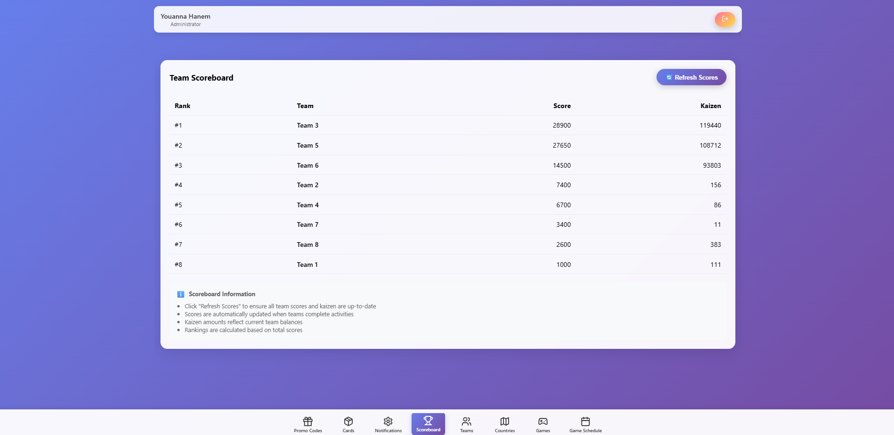
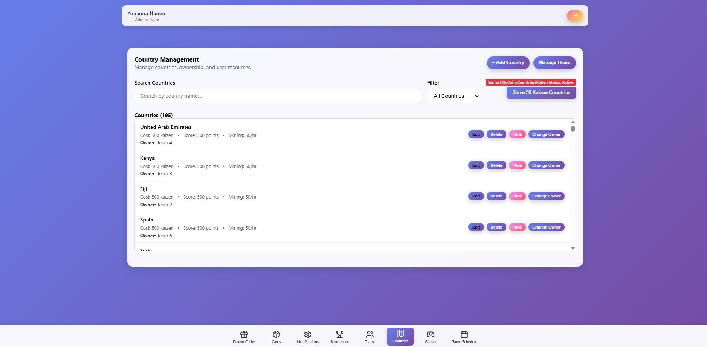
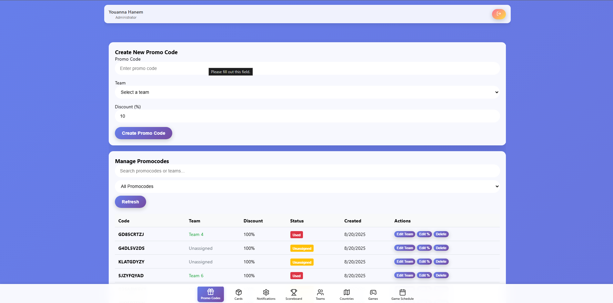
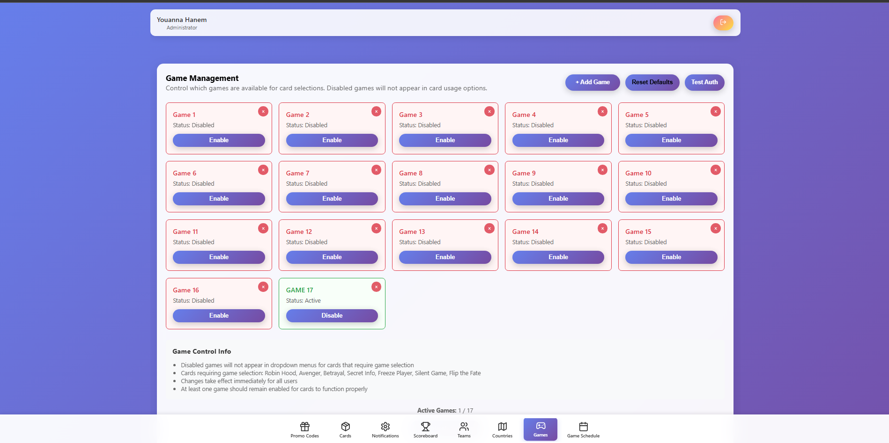
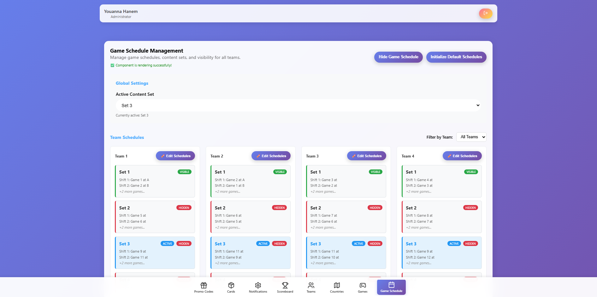
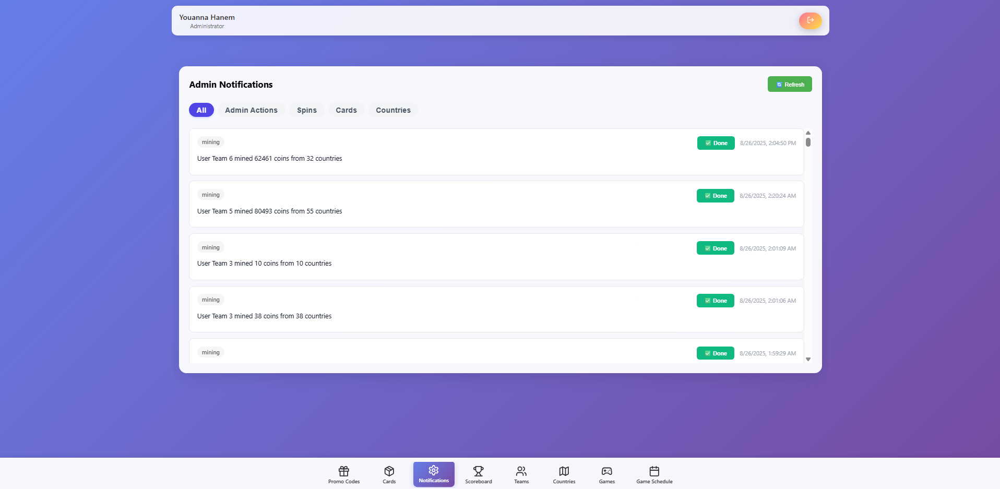
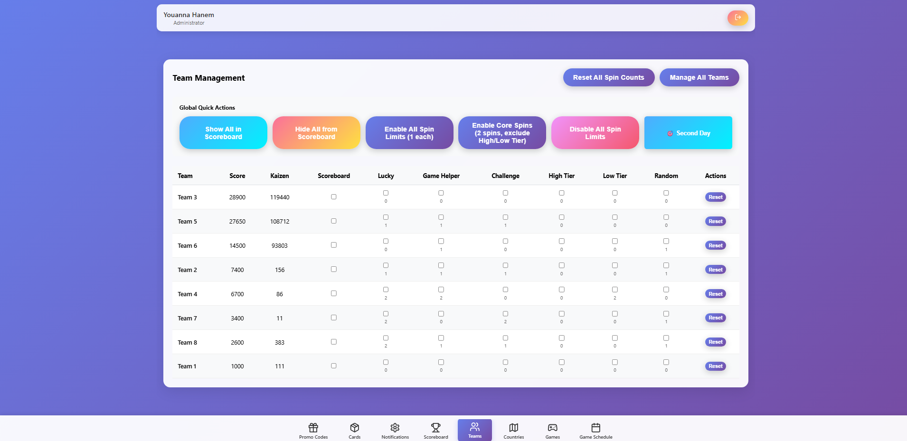
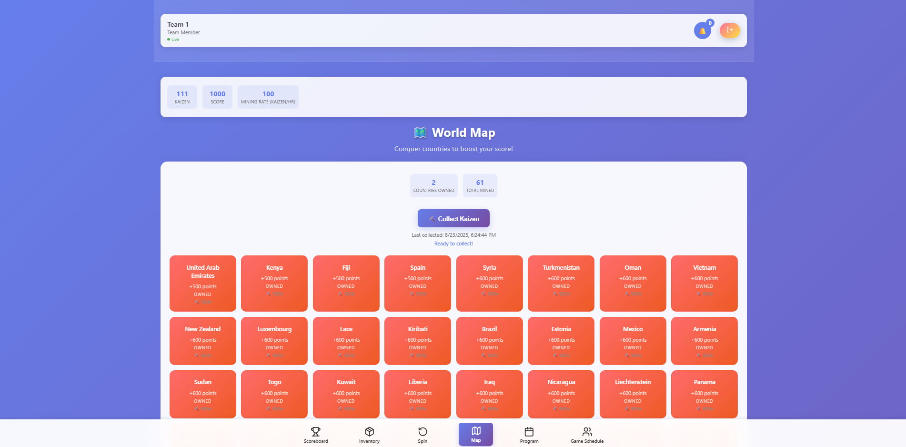

### 🏆 Saint Paul Grand Game Scoring System Frontend

Welcome to the official frontend repository for the Saint Paul Grand Game Scoring System\! This application is a dynamic, real-time platform designed to manage and enhance the team-based competition experience for volunteering camps. Built with a modern tech stack and a mobile-first philosophy, it serves as the central hub for team members and administrators, gamifying the entire event with live scoring, strategic card collection, and interactive challenges.

-----

### ✨ Core Features

This application is built for both participants (Team Members) and event organizers (Administrators), offering a rich set of features to make the competition engaging and manageable.

#### **Team Member Features**

  * **Live Scoreboard**: A real-time leader board that displays team rankings, scores, and currency (Kaizen) in an engaging format, with live visual cues for updates.
  * **Dynamic Inventory**: A personal inventory system for collecting and using various "cards" earned through the game. Cards have unique effects categorized as:
      * **Attack Cards**: Impact other teams' scores or resources.
      * **Alliance Cards**: Facilitate collaboration and score boosts with other teams.
      * **Luck Cards**: Offer personal advantages or special actions.
  * **The Spin & Win System**: A central hub for earning new cards and resources. It features multiple spin types with varying costs and rewards, including:
      * **Lucky Spin** for instant currency and gifts.
      * **Game Helper** for strategic cards tied to specific games.
      * **Challenge Spins** that present skill-based mini-games with timers, like "Speed Buy" or "Mystery Question (MCQ)".
      * **High & Low Tier** options for premium and entry-level rewards.
  * **Interactive World Map**: A visual representation of a world map where teams can "conquer" countries by spending Kaizen. Owning countries grants score points and a continuous mining rate of Kaizen.
  * **Event Schedule**: A dedicated tab to view the camp's program and game schedules, including matchups and locations, keeping teams informed about upcoming activities.

#### **Administrator Features**

  * **Comprehensive Management Dashboard**: A centralized control panel for event organizers to oversee all game aspects.
  * **Team & Score Management**: View and edit all team details, scores, and Kaizen balances.
  * **Promo Code System**: Create and manage promo codes with custom discounts, assigning them to specific teams for strategic advantages.
  * **Card Distribution**: Manually grant any type of card to an individual team or all teams at once.
  * **Real-time Notifications**: Receive live updates on all user actions, such as card usage and team activities, with a built-in action tracking system.
  * **Game & Schedule Control**: Toggle game visibility for card usage, and manage the full schedule of camp activities and team matchups.

-----

### 💻 Technology Stack

  * **Frontend Framework**: React.js
  * **State Management**: React Context API
  * **Styling**: Custom CSS, with a mobile-first and responsive design approach.
  * **UI Components**: Lucide React for crisp, modern icons.
  * **API Client**: Axios.
  * **Real-time Communication**: Socket.io for live updates on scores, notifications, and game events.
  * **Build Tools**: Webpack, Babel.
  * **Authentication**: Dual-authentication system for cross-browser compatibility, especially on iOS Safari.

-----

### 🎨 User Interface & User Experience

The application is designed to be intuitive and visually appealing. The mobile-first design ensures a seamless experience across all devices. A user-friendly navigation bar provides quick access to all core features, and real-time toasts and modal notifications keep users engaged and informed of important game events.

-----

### 📷 Screenshots

| Admin Scoreboard | Admin Countries Management | Admin Promocode Management | Admin Cards Management |
| :---: | :---: | :---: | :---: |
|  |  |  |  |

| Admin Games Management | Admin Game Schedule Management | Admin Notifications Management | Admin Spins Management |
| :---: | :---: | :---: | :---: |
|  |  |  |  |

| User Login | User Countries |
| :---: | :---: |
|  |  |

-----

### 🚀 Getting Started

To get a local copy of this project up and running, follow these simple steps:

1.  Clone the repository: `git clone https://github.com/aymanashrafmounir/saintpaul-scoringsystem-frontend.git`
2.  Install dependencies: `npm install`
3.  Configure your environment variables (refer to the `.env` file for guidance).
4.  Start the development server: `npm start`
5.  Open your browser to `http://localhost:3000` to view the application.

-----

Developed with passion by Ayman Ashraf Mounir.
